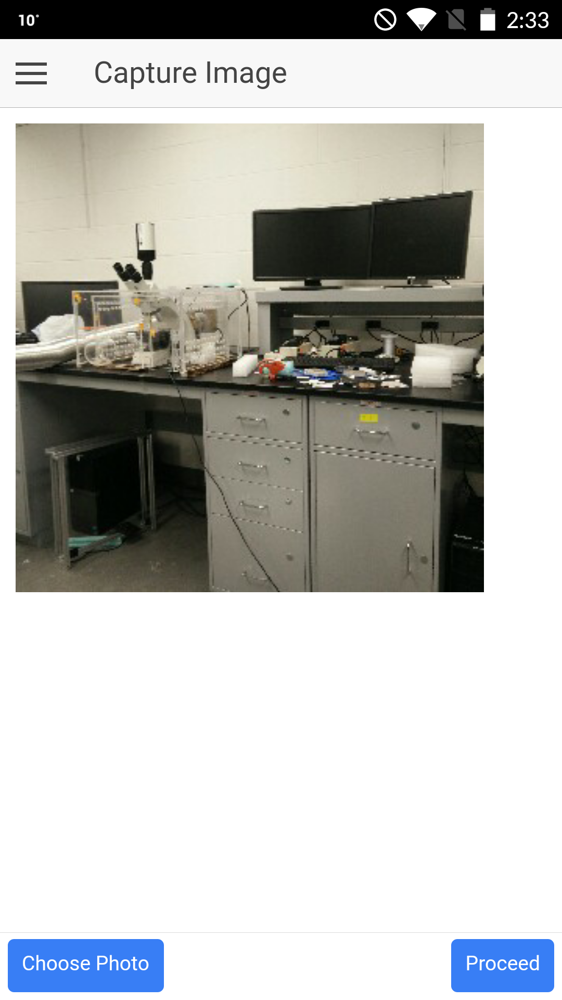
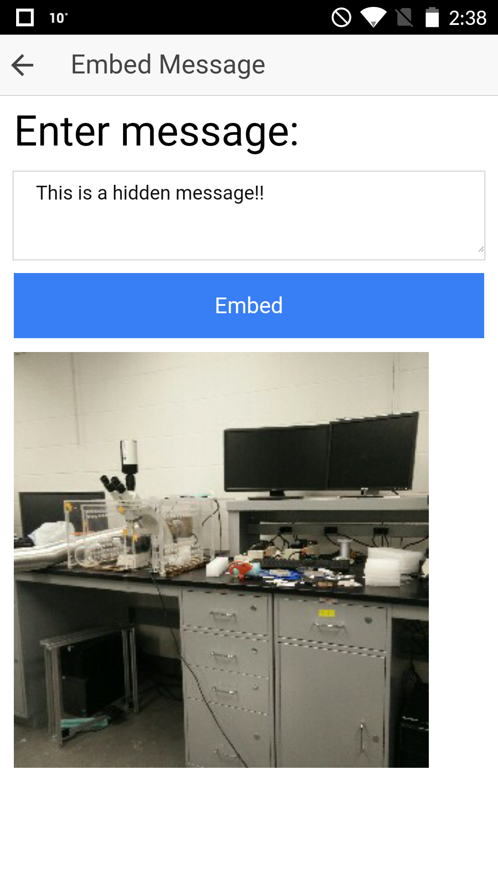
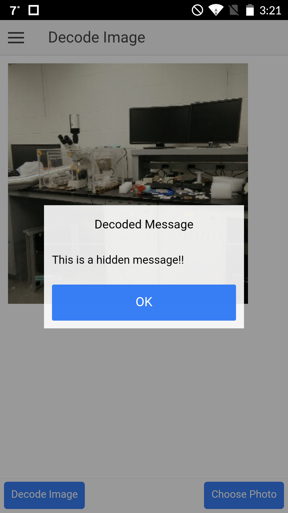

Steganography App Demo
=====================

This App applies steganography techniques to embed messages in image and send it to your friends.

Requirements
--------------

*Environment Setup*

- Install [Node.js]
- Run ``npm install -g cordova ionic``
- Install development tools by following guides [Android] and [iOS]

Usage
-------
Clone this repository and change directory
```bash
git clone git@bitbucket.org:upender_kalwa/stegoapp.git
cd StegoApp
```

To run the app
```bash
ionic serve
```

Here are some of the snapshots
------------------------------

<p float="left">
  
  &nbsp; &nbsp; &nbsp;
   
  &nbsp; &nbsp; &nbsp;
  
</p>

License
---------

This code is GNU GENERAL PUBLIC LICENSED.

Contributing
-------------

If you have any suggestions or identified bugs please feel free to post
them!

  
 [Node.js]: http://nodejs.org
 [Android]: https://cordova.apache.org/docs/en/6.x/guide/platforms/android/
 [iOS]: https://cordova.apache.org/docs/en/6.x/guide/platforms/ios/
 [image1]: images/image1.png
 [image2]: images/image2.png